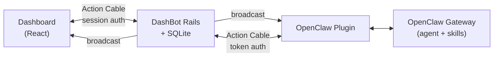

# DashBot

AI-enabled dashboard utility for your car, gadget, or browser.


Born during a commute — I was driving on FSD and wanted to chat with my [OpenClaw](https://openclaw.ai/) server at home to vibe code in traffic. That session produced a working real-time feedback dashboard, deployed to a subdomain and opened in my Tesla's browser. DashBot takes that proof of concept and rebuilds it on proper foundations — with a plugin widget system so I can keep vibe-coding on future commutes, and open-sourced for anyone who wants to try it.



## Quick start

### 1. Start DashBot

```sh
bin/setup              # install deps, prepare DB, start server
```

Or step by step:

```sh
bundle install && npm install
cp .env.example .env
bin/rails db:prepare
```

Fill in `.env`:

```env
DASHBOT_PASSWORD=<pick a password>
DASHBOT_API_TOKEN=<generate with: ruby -e "require 'securerandom'; puts SecureRandom.hex(32)">
```

Start the server:

```sh
bin/dev                # Rails on :3000, Vite HMR on :5173
```

### 2. Connect OpenClaw

Requires an [OpenClaw](https://openclaw.ai/) gateway. Clone and install the plugin:

```sh
git clone https://github.com/eddanger/dashbot-openclaw.git
cd dashbot-openclaw
npm install
```

Install into OpenClaw and configure:

```sh
openclaw plugins install -l /path/to/dashbot-openclaw

# Point the plugin at your DashBot server
openclaw config set channels.dashbot.enabled true
openclaw config set channels.dashbot.url http://localhost:3000
openclaw config set channels.dashbot.token <your DASHBOT_API_TOKEN>
```

Restart the gateway to pick up the plugin:

```sh
openclaw gateway restart
```

### 3. Verify

1. Open `http://localhost:3000` and log in
2. Type a message in the chat
3. The OpenClaw gateway logs should show `[default] inbound: <your message>`
4. The agent processes and responds — the reply appears in the dashboard in real-time

Check gateway logs:

```sh
openclaw logs
```

## Running tests

```sh
bin/rails test         # Rails (Minitest)
npm test               # Frontend (Vitest)
npm run check          # TypeScript
bin/rubocop            # Ruby linting
bin/ci                 # Full CI suite
```

## Environment variables

Copy `.env.example` to `.env`. Key variables:

| Variable | Required | Purpose |
|----------|----------|---------|
| `DASHBOT_PASSWORD` | Yes (seed) | Admin user password |
| `DASHBOT_API_TOKEN` | Yes (plugin) | Shared secret for plugin auth (Action Cable + REST) |
| `RAILS_MASTER_KEY` | Yes (prod) | Decrypts credentials |

See `.env.example` for the full list.

## Documentation

| Doc | Contents |
|-----|----------|
| [OpenClaw Integration](docs/openclaw.md) | Architecture, ChatChannel, connection auth, plugin setup |
| [REST API](docs/api.md) | Endpoint reference with request/response examples |
| [Deployment](docs/deployment.md) | Docker, Kamal, Dokku, persistent storage |

## OpenClaw plugin

The channel plugin that connects OpenClaw to DashBot lives in a separate repo:

[`dashbot-openclaw`](https://github.com/eddanger/dashbot-openclaw) — TypeScript Action Cable client that bridges the OpenClaw agent gateway to the DashBot dashboard in real-time. See its README for plugin-specific docs.

## Tech stack

- **Backend:** Rails 8.1, Ruby 4.0.1, SQLite3
- **Frontend:** React 19, TypeScript 5.9, Vite 7, Tailwind v4
- **Bridge:** Inertia.js
- **UI:** shadcn/ui (New York style), Lucide icons
- **Real-time:** Action Cable (async dev, Solid Cable production)
- **Background jobs:** Solid Queue
- **Caching:** Solid Cache
- **Web server:** Puma + Thruster
