# DashBot

A real-time dashboard that gives you a window into your [OpenClaw](https://openclaw.ai/) AI assistant — chat, monitor status, and interact with agent-driven cards from any browser.

* **Connected:** Plugs into your OpenClaw gateway via the [dashbot-openclaw](https://github.com/wembledev/dashbot-openclaw) plugin for live two-way communication.
* **Mobile-first:** Designed for Tesla browsers, phones, and tablets — works great on desktop too.
* **Extensible:** Widget system for custom status panels, agentic cards, and integrations.

[![CI][ci-badge]][ci-url]
[![Ruby][ruby-badge]][ruby-url]
[![Rails][rails-badge]][rails-url]
[![License: MIT][mit-badge]][mit-url]

[ci-badge]: https://github.com/wembledev/dashbot/actions/workflows/ci.yml/badge.svg?branch=main
[ci-url]: https://github.com/wembledev/dashbot/actions/workflows/ci.yml
[ruby-badge]: https://img.shields.io/badge/Ruby-4.0-red.svg
[ruby-url]: https://www.ruby-lang.org/
[rails-badge]: https://img.shields.io/badge/Rails-8.1-red.svg
[rails-url]: https://rubyonrails.org/
[mit-badge]: https://img.shields.io/badge/license-MIT-blue.svg
[mit-url]: https://github.com/wembledev/dashbot/blob/main/LICENSE

## How It Works

```mermaid
graph TD
    Dashboard["🖥️ Dashboard"]
    DashBot["⚡ DashBot"]
    Plugin["🔌 dashbot-openclaw plugin"]
    Gateway["🤖 OpenClaw Gateway"]

    Dashboard <--> DashBot
    DashBot <--> Plugin
    Plugin <--> Gateway
```



Your OpenClaw AI agent runs on the gateway. The [dashbot-openclaw](https://github.com/wembledev/dashbot-openclaw) plugin connects it to DashBot over WebSockets, streaming chat messages, status updates, and agentic card interactions in real time. Open the dashboard in any browser to see what your agent is up to.

## Screenshots

| Chat | Status | Settings |
|------|--------|----------|
|  |  |  |

## Features

- 💬 **Chat** — Talk to your AI agent with real-time streaming responses
- 📊 **Status dashboard** — Monitor agent health, memory, token usage, and cron jobs
- 🎯 **Agentic cards** — Interactive prompt/response widgets for structured AI actions
- 🔌 **OpenClaw plugin** — Drop-in integration via [dashbot-openclaw](https://github.com/wembledev/dashbot-openclaw)
- 🔐 **QR code login** — Scan to authenticate from any device
- 🌙 **Dark mode** — Full theme support with system preference detection
- ⚙️ **Settings that work** — Configure default model, save quick memory notes, trigger memory reindex, and tune notifications
- 📱 **Responsive** — Mobile-first design that scales to desktop

## Getting Started

### Prerequisites

- Ruby 4.0+
- Node.js 22+
- SQLite3

### Setup

```sh
git clone https://github.com/wembledev/dashbot.git
cd dashbot
bin/setup              # install deps, prepare DB
```

Or step by step:

```sh
bundle install && npm install
cp .env.example .env
bin/rails db:prepare
```

Configure `.env`:

```env
DASHBOT_PASSWORD=<pick a password>
DASHBOT_API_TOKEN=<generate with: ruby -e "require 'securerandom'; puts SecureRandom.hex(32)">

# Optional but recommended when accessing from phone/Tailscale.
# Used for QR login links + host authorization.
DASHBOT_PUBLIC_URL=https://<your-tailnet-host>.ts.net
```

### Run

```sh
bin/dev                # Rails on :3000, Vite HMR on :5173
```

Open `http://localhost:3000` and log in.

### Connect Your Agent

DashBot connects to your AI assistant via the [dashbot-openclaw](https://github.com/wembledev/dashbot-openclaw) plugin. Install the plugin into your OpenClaw gateway, point it at your DashBot instance, and you're live. See the [plugin README](https://github.com/wembledev/dashbot-openclaw) for setup.

## Testing

```sh
bin/rails test         # Rails (Minitest)
npm test               # Frontend (Vitest)
npm run check          # TypeScript type checking
bin/rubocop            # Ruby linting
bin/ci                 # Full CI suite
```

## Deployment

DashBot deploys as a standard Rails 8 app with SQLite. See [docs/deployment.md](docs/deployment.md) for Docker, Kamal, and Dokku instructions.

## Architecture

DashBot is a Rails 8 monolith with a React frontend, connected via Inertia.js:

| Layer | Technology |
|-------|-----------|
| **Backend** | Rails 8.1, Ruby 4.0, SQLite3 |
| **Frontend** | React 19, TypeScript, Vite 7, Tailwind v4 |
| **Bridge** | Inertia.js (server-driven SPA) |
| **UI** | shadcn/ui, Lucide icons |
| **Real-time** | Action Cable (Solid Cable in production) |
| **Jobs** | Solid Queue |
| **Caching** | Solid Cache |
| **Server** | Puma + Thruster |

## Documentation

| Doc | Contents |
|-----|----------|
| [OpenClaw Integration](docs/openclaw.md) | Architecture, ChatChannel, connection auth, plugin setup |
| [REST API](docs/api.md) | Endpoint reference with request/response examples |
| [Deployment](docs/deployment.md) | Docker, Kamal, Dokku, persistent storage |

## Contributing

Contributions are welcome! Please:

1. Fork the repo and create your branch from `main`
2. Add tests for any new functionality
3. Ensure the test suite passes (`bin/ci`)
4. Open a pull request

## License

This project is licensed under the [MIT License](LICENSE).
