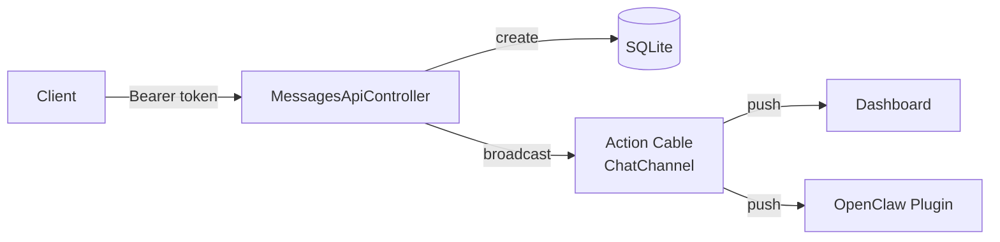

# Messages REST API

All endpoints require token authentication via the `Authorization` header:

```
Authorization: Bearer <DASHBOT_API_TOKEN>
```

Responses are JSON. The API controller inherits from `ActionController::API` (no CSRF, no browser checks).

## Overview



## Endpoints

### List sessions

```
GET /api/messages/sessions
```

**Response:**

```json
{
  "sessions": [
    {
      "id": 1,
      "title": "Chat",
      "updated_at": "2026-01-30T13:01:50-08:00",
      "message_count": 5
    }
  ]
}
```

### Get messages for a session

```
GET /api/messages/sessions/:id
```

**Response:**

```json
{
  "session_id": 1,
  "messages": [
    {
      "id": 1,
      "role": "user",
      "content": "Hello",
      "metadata": null,
      "created_at": "2026-01-30T12:00:00-08:00"
    },
    {
      "id": 2,
      "role": "assistant",
      "content": "Hi there!",
      "metadata": null,
      "created_at": "2026-01-30T12:00:01-08:00"
    }
  ]
}
```

### Send a user message

```
POST /api/messages/send
```

**Body:**

```json
{
  "content": "Hello",
  "session_id": 1
}
```

`session_id` is optional. If omitted, the first available session is used (or a new one is created).

**Response (201):**

```json
{
  "message": {
    "id": 3,
    "role": "user",
    "content": "Hello",
    "metadata": null,
    "created_at": "2026-01-30T12:01:00-08:00"
  }
}
```

### Send an assistant response

```
POST /api/messages/respond
```

**Body:**

```json
{
  "content": "I can help with that!",
  "session_id": 1,
  "metadata": { "model": "gpt-4", "tokens": 42 }
}
```

`metadata` is optional (stored as JSON).

**Response (201):**

```json
{
  "message": {
    "id": 4,
    "role": "assistant",
    "content": "I can help with that!",
    "metadata": { "model": "gpt-4", "tokens": 42 },
    "created_at": "2026-01-30T12:01:01-08:00"
  }
}
```

## WebSocket (Action Cable)

Connect to `/cable?token=<DASHBOT_API_TOKEN>` for real-time messaging. Both REST and WebSocket endpoints broadcast to the same Action Cable channel, so messages sent via either method appear in the dashboard instantly.

See [openclaw.md](openclaw.md) for the Action Cable protocol and sequence diagrams.

## Errors

| Status | Meaning |
|--------|---------|
| 401 | Missing or invalid token |
| 404 | Session not found |
| 422 | Validation error (e.g., empty content) |
