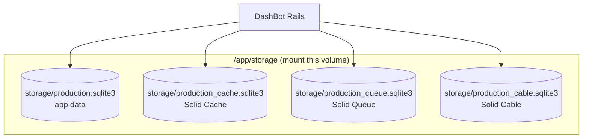
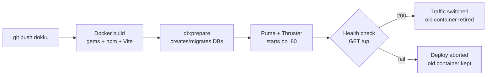

# Deployment

## Docker

Build the image:

```sh
docker build -t dashbot .
```

Run with required environment variables:

```sh
docker run -d \
  -p 80:80 \
  -e RAILS_MASTER_KEY=<your-master-key> \
  -e DASHBOT_PASSWORD=<your-password> \
  -e DASHBOT_API_TOKEN=<your-token> \
  -v dashbot-storage:/app/storage \
  --name dashbot \
  dashbot
```

The entrypoint runs `db:prepare` automatically on startup. To seed the initial admin user:

```sh
docker exec dashbot bin/rails db:seed
```

## Persistent storage

DashBot uses SQLite for everything (app data, cache, queue, cable). The `storage/` directory must be persisted across container restarts. Mount a volume to `/app/storage` as shown above.



## Health check

The `/up` endpoint returns 200 when the app is running and the database is available.

## PaaS notes

**Kamal** -- The Dockerfile is compatible with Kamal out of the box. Add your deploy config in `config/deploy.yml`.

**Dokku** -- The deploy pipeline runs automatically on `git push`:



Create the app and configure it before the first deploy:

```sh
# Create app
ssh dokku@your-server apps:create dashbot

# Set required environment variables
ssh dokku@your-server config:set dashbot \
  RAILS_MASTER_KEY=<from config/master.key> \
  DASHBOT_PASSWORD=<pick a password> \
  DASHBOT_API_TOKEN=<generate with: ruby -e "require 'securerandom'; puts SecureRandom.hex(32)">

# Mount persistent storage for SQLite databases
ssh dokku@your-server storage:ensure-directory dashbot
ssh dokku@your-server storage:mount dashbot /var/lib/dokku/data/storage/dashbot:/app/storage

# Add SSL (Let's Encrypt)
ssh dokku@your-server letsencrypt:enable dashbot
```

Deploy by pushing to the Dokku remote:

```sh
git remote add dokku dokku@your-server:dashbot
git push dokku main
```

If deploying from a branch other than `main`:

```sh
git push dokku your-branch:main
```

Verify after deploy:

```sh
curl -s https://your-domain/up
# Should return 200
```

Seed the admin user on first deploy:

```sh
ssh dokku@your-server run dashbot bin/rails db:seed
```

## Action Cable in production

Production uses Solid Cable (SQLite-backed pub/sub) -- no Redis required. The `solid_cable` gem, cable database in `database.yml`, and cable schema in `db/cable_schema.rb` are all required for this to work. Configuration is in `config/cable.yml`:

```yaml
production:
  adapter: solid_cable
  connects_to:
    database:
      writing: cable
  polling_interval: 0.1.seconds
  message_retention: 1.day
```

WebSocket connections are served by Puma on the same process. Thruster handles HTTP/2 and SSL termination in front.

### Forgery protection

Production disables Action Cable request forgery protection (`config.action_cable.disable_request_forgery_protection = true`) so that server-side WebSocket clients like the OpenClaw plugin — which connect without a browser Origin header — are not rejected. Browser connections are still authenticated via session cookie or API token.
