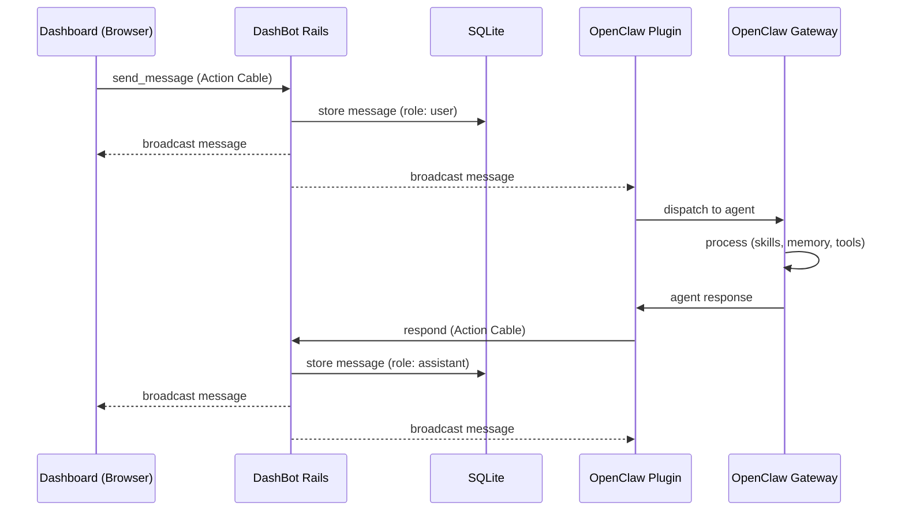
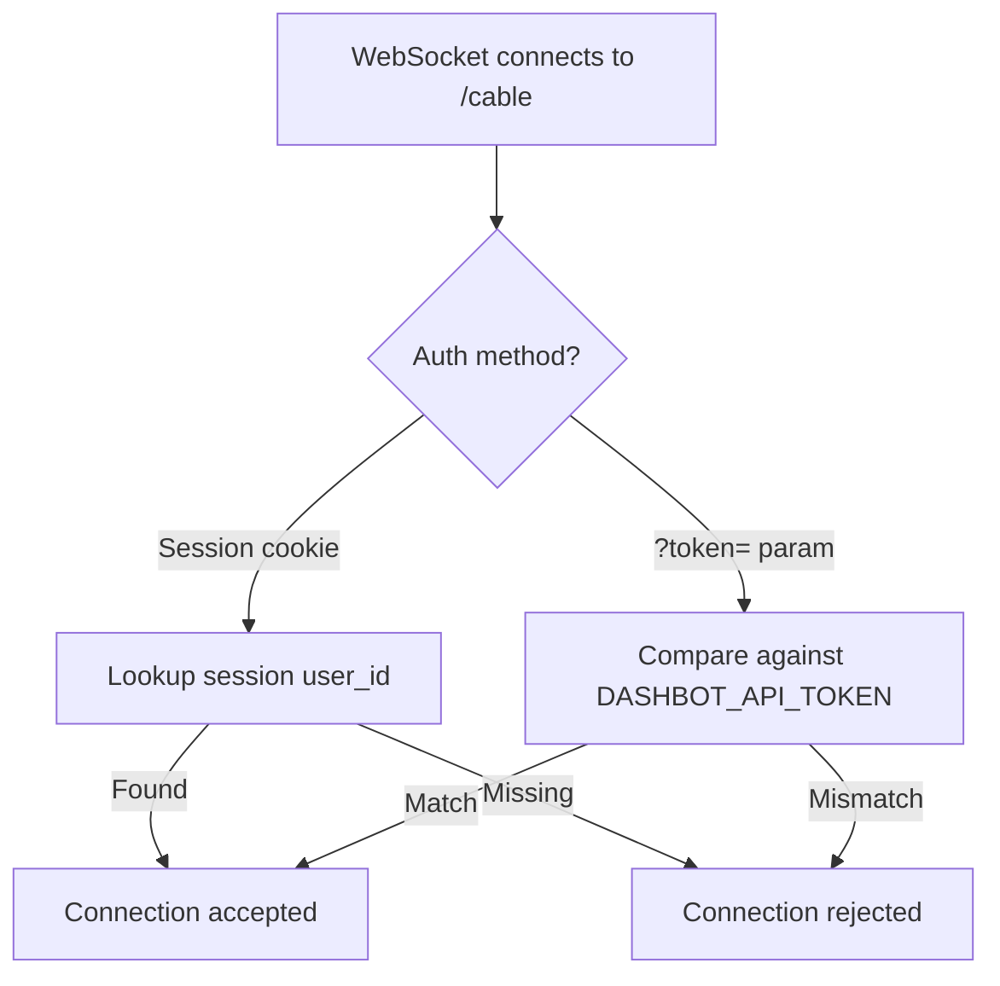
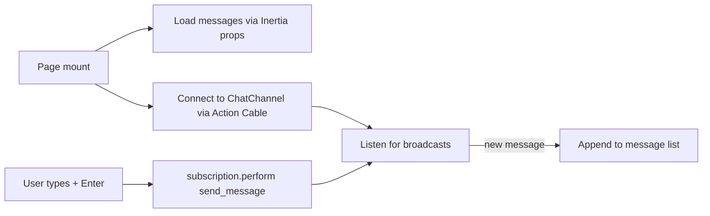
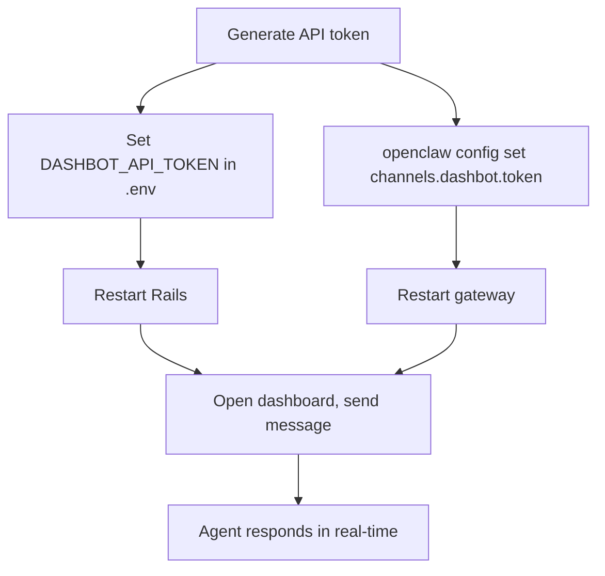
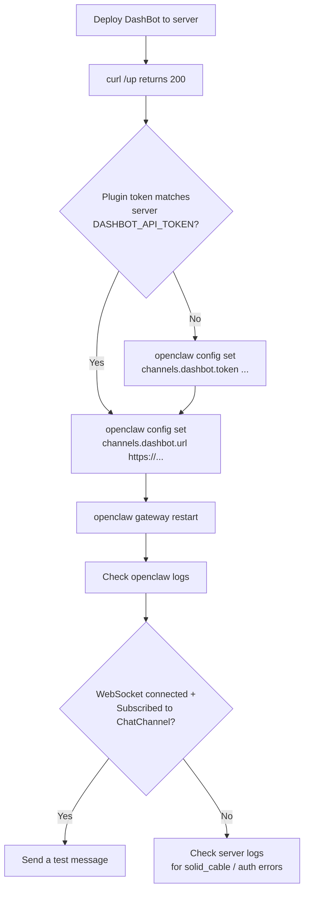
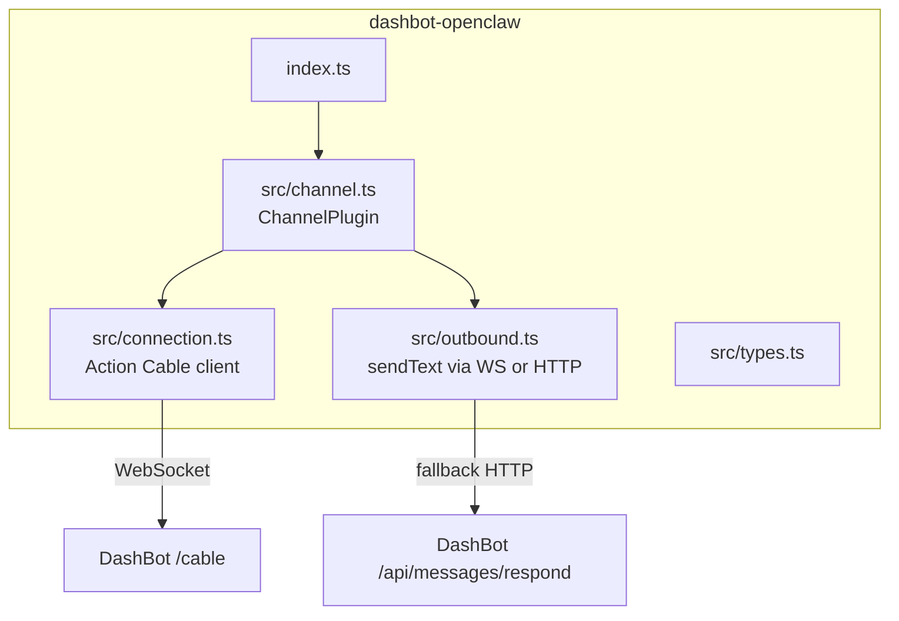

# OpenClaw Integration

DashBot connects to [OpenClaw](https://openclaw.ai/) via a channel plugin. Messages flow over Action Cable (WebSocket) in real-time between the dashboard, Rails, and the OpenClaw agent.

## Architecture



## Connection auth



Two authentication modes in `app/channels/application_cable/connection.rb`:

- **Browser** -- session cookie (existing `current_user` from Rails session)
- **Plugin** -- Bearer token via query param (`/cable?token=<DASHBOT_API_TOKEN>`)

## ChatChannel

`app/channels/chat_channel.rb`

WebSocket channel for real-time messaging. Streams from `chat_<session_id>`.

| Action | Role | What it does |
|--------|------|-------------|
| `send_message(content)` | user | Creates a user message, broadcasts to subscribers |
| `respond(content, metadata)` | assistant | Creates an assistant message, broadcasts to subscribers |

On subscribe, the channel finds an existing session or creates a new one for the connected user.

## REST API

Fallback endpoints when WebSocket isn't available. See [api.md](api.md) for the full reference.

| Endpoint | Method | Purpose |
|----------|--------|---------|
| `/api/messages/send` | POST | Create user message + broadcast |
| `/api/messages/respond` | POST | Create assistant message + broadcast |
| `/api/messages/sessions` | GET | List chat sessions |
| `/api/messages/sessions/:id` | GET | Message history for a session |

Both REST and WebSocket writes broadcast to the same Action Cable channel, so messages appear in the dashboard regardless of which method sent them.

## Dashboard UI

`app/frontend/pages/home/index.tsx`



- Connects to ChatChannel on mount
- Loads message history via Inertia props (server-rendered)
- Sends messages via `subscription.perform('send_message', ...)`
- Receives real-time updates via WebSocket broadcast
- Messages rendered as bubbles (user right, assistant left)
- Connection status indicator (green/red dot)

## Setup



### 1. Generate a shared API token

```sh
ruby -e "require 'securerandom'; puts SecureRandom.hex(32)"
```

This token is used by both DashBot (to authenticate incoming WebSocket/REST connections) and the OpenClaw plugin (to connect to DashBot).

### 2. Configure DashBot

Add the token to your `.env`:

```env
DASHBOT_API_TOKEN=<generated-token>
```

Restart Rails to pick it up:

```sh
bin/dev
```

### 3. Install and configure the OpenClaw plugin

```sh
git clone https://github.com/wembledev/dashbot-openclaw.git
cd dashbot-openclaw
npm install

openclaw plugins install -l /path/to/dashbot-openclaw
openclaw config set channels.dashbot.enabled true
openclaw config set channels.dashbot.url http://localhost:3000
openclaw config set channels.dashbot.token <generated-token>
openclaw gateway restart
```

### 4. Verify

Check that the plugin connected:

```sh
openclaw logs
# Should show: [default] connecting to http://localhost:3000
# And: Subscribed to ChatChannel
```

Open the dashboard, type a message. The gateway logs should show:

```
[default] inbound: <your message>
[default] outbound: <agent response>
```

The response appears in the dashboard in real-time.

### 5. Production deployment



When deploying DashBot to a server, update the plugin to point at the production URL:

```sh
openclaw config set channels.dashbot.url https://dashbot.example.com
openclaw gateway restart
```

Ensure the token matches `DASHBOT_API_TOKEN` on the server:

```sh
# Check current plugin token
openclaw config get channels.dashbot.token

# If different from what's set on the server, update it
openclaw config set channels.dashbot.token <production DASHBOT_API_TOKEN>
openclaw gateway restart
```

After restarting, check the gateway logs for a successful connection:

```sh
openclaw logs
# Should show: Connecting to wss://dashbot.example.com/cable?token=...
# And: WebSocket connected
# And: Subscribed to ChatChannel
```

**Note:** Production requires `config.action_cable.disable_request_forgery_protection = true` in `config/environments/production.rb` so that server-side WebSocket clients (which don't send a browser Origin header) are accepted. See [deployment.md](deployment.md#forgery-protection) for details.

### 5. Test the REST API (optional)

```sh
# List sessions
curl -s http://localhost:3000/api/messages/sessions \
  -H 'Authorization: Bearer <token>'

# Send an assistant response
curl -s -X POST http://localhost:3000/api/messages/respond \
  -H 'Authorization: Bearer <token>' \
  -H 'Content-Type: application/json' \
  -d '{"content":"Hello from the plugin","session_id":1}'
```

## OpenClaw plugin repo

The plugin lives in a separate repo: [`dashbot-openclaw`](https://github.com/wembledev/dashbot-openclaw)



See the [plugin README](https://github.com/wembledev/dashbot-openclaw) for the full configuration reference, Action Cable protocol details, and development setup.
